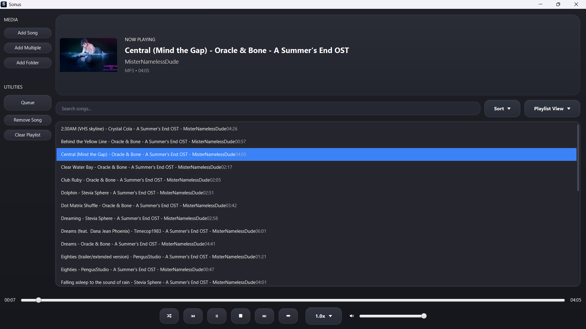
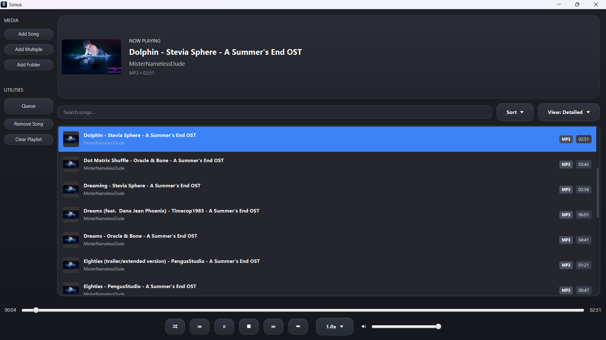
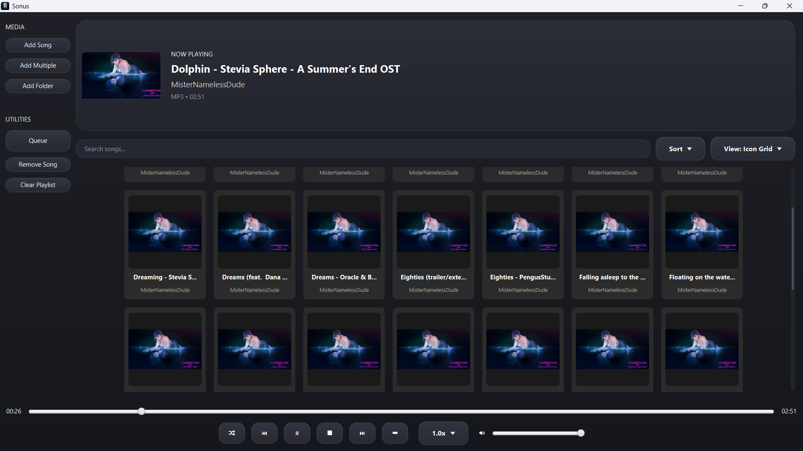
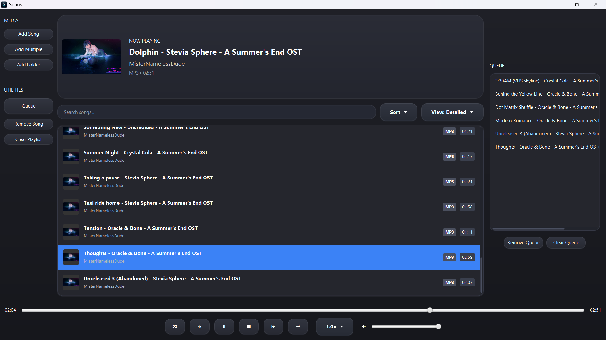

# Sonus 🎧

A modern desktop audio player built with Java and JavaFX.

Sonus is a lightweight music player focused on local audio playback, playlist management, metadata extraction, album artwork support, and keyboard-driven usability. It provides a clean dark-themed interface while supporting multiple audio formats and flexible playlist viewing modes.

---

## Features

### Audio Playback

* Multi-format audio support
* Play, Pause, Stop
* Previous / Next Track
* Playback Speed Control
* Automatic Track Progression
* Shuffle Playback
* Repeat Playlist
* Repeat Single Track

### Supported Formats

* MP3
* WAV
* FLAC
* M4A
* AAC

### Playlist Management

* Add Individual Files
* Add Multiple Files
* Import Entire Folders
* Search Songs Instantly
* Remove Songs
* Clear Playlist
* Sort By:

    * Title
    * Artist
    * Duration
    * Recently Added

### Queue System

* Dedicated Playback Queue
* Add Tracks to Queue
* Remove Queued Tracks
* Clear Queue
* Toggle Queue Visibility

### Metadata & Artwork

* Embedded Artwork Extraction
* Metadata Detection
* Artist Information Display
* Duration Display
* Format Identification
* Artwork Caching for Improved Performance

### User Interface

* Modern Dark Theme
* Compact List View
* Detailed View
* Artwork Grid View
* Now Playing Section
* Responsive Layout
* Context Menus
* Keyboard Navigation

### Keyboard Shortcuts

| Shortcut      | Action                 |
| ------------- | ---------------------- |
| Space         | Play / Pause           |
| Enter         | Play Selected Track    |
| ← / →         | Previous / Next Track  |
| Shift + ← / → | Seek ±10 Seconds       |
| ↑ / ↓         | Volume Control         |
| Shift + ↑ / ↓ | Fast Volume Adjustment |
| Ctrl + O      | Add Audio File         |
| Ctrl + M      | Add Multiple Files     |
| Ctrl + L      | Add Folder             |
| Ctrl + F      | Focus Search           |
| Ctrl + Q      | Toggle Queue           |
| Ctrl + P      | Play / Pause           |
| Ctrl + N      | Next Track             |
| Ctrl + B      | Previous Track         |
| Ctrl + S      | Toggle Shuffle         |
| Ctrl + R      | Toggle Repeat          |
| Ctrl + X      | Stop Playback          |
| Delete        | Remove Selected Track  |

---

## Screenshots

### Main Interface



### Detailed Playlist View



### Artwork Grid View



### Queue System



---

## Technology Stack

* Java 21
* JavaFX 21
* Maven
* JavaCV
* JAudioTagger
* Gson

---

## Building From Source

```bash
mvn clean package
```

Run the application:

```bash
mvn javafx:run
```

---

## Roadmap

### v0.1.0

* Multi-format playback
* Playlist management
* Queue system
* Metadata extraction
* Artwork support
* Keyboard shortcuts
* Multiple playlist views

### Future Releases

* Mini Player Mode
* System Tray Integration
* Equalizer
* Audio Visualizer
* Smart Playlists
* Additional Themes

---

## License

This project is licensed under the MIT License.

See the LICENSE file for details.
